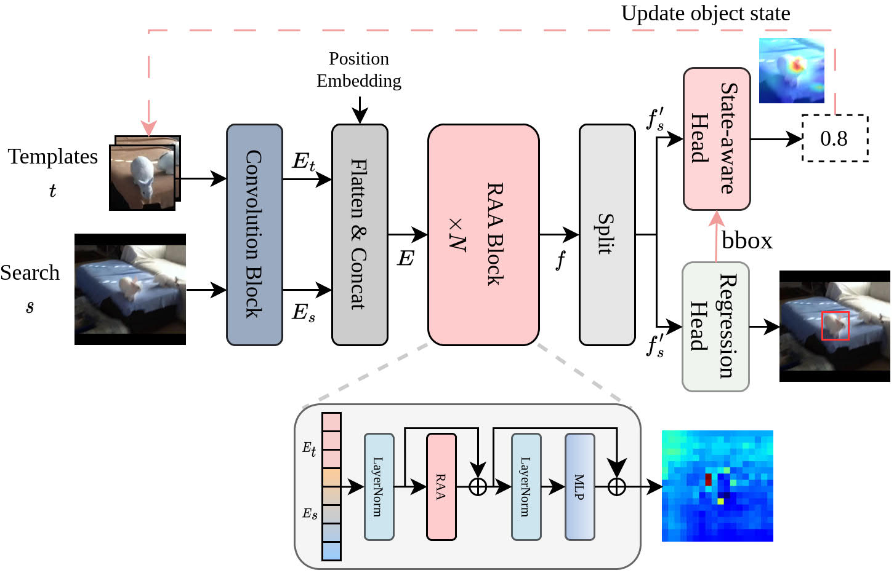

# ARATrack: Adaptive representation-aligned modeling for visual tracking

The official implementation of ARATrack: [Knowledge-based Systems](https://www.sciencedirect.com/science/article/pii/S0950705124014813)




## Brief Introduction
Accurate object representations and reliable object states are essential for robust visual tracking. While current Transformer-based trackers use symmetric and asymmetric attention mechanisms to learn object representations, they often overlook attention discrepancies between the template and search region.
These discrepancies can lead to the inclusion of distractors, which degrade the quality of the learned representations. To address this issue, we propose ARATrack, an adaptive \textcolor{red}{representation-aligned} tracker. Specifically, we present a representation-aligned attention (ARR), which adaptively refines object representations through a novel attention alignment strategy. This strategy ensures consistent attention between the template and search region, while minimizing interference from irrelevant features.
Furthermore, to handle dynamic changes in object states, we propose a state-aware head that updates the object state based on the refined representations, enhancing robustness to appearance variations. 
These components work synergistically, offering mutual guidance to ensure ARATrack delivers stable and reliable visual tracking. Extensive experiments on six benchmark datasets demonstrate that ARATrack outperforms other state-of-the-art trackers, achieving competitive performance across a wide range of tracking scenarios.

| Tracker  | LaSOT (AUC) | GOT-10K (AO) | TrackingNet (AUC) | UAV123 (AUC) | TNL2k (AUC) | LaSO_ext (AUC) |
|----------|-------------|--------------|-------------------|--------------|-------------|----------------|
| ARATrack | 71.3        | 75.3         | 84.9              | 69.7         | 57.7        | 51.4           |


## Install the environment
Use the Anaconda
```
conda create -n aratrack python=3.10
conda activate aratrack
bash install_pytorch.sh
```

## Data Preparation
Put the tracking datasets in ./data. It should look like:
   ```
   ${ARATrack_ROOT}
    -- data
        -- lasot
            |-- airplane
            |-- basketball
            |-- bear
            ...
        -- got10k
            |-- test
            |-- train
            |-- val
        -- coco
            |-- annotations
            |-- train2017
        -- trackingnet
            |-- TRAIN_0
            |-- TRAIN_1
            ...
            |-- TRAIN_11
            |-- TEST
   ```
## Set project paths
Run the following command to set paths for this project
```
python tracking/create_default_local_file.py --workspace_dir . --data_dir ./data --save_dir .
```
After running this command, you can also modify paths by editing these two files
```
lib/train/admin/local.py  # paths about training
lib/test/evaluation/local.py  # paths about testing
```

## Train ARAtrack
Training with multiple GPUs using DDP. More details of 
other training settings can be found at ```tracking/train_aratrack.sh``` for different backbone respectively.
```
bash tracking/train_aratrack.sh
```

## Test and evaluate ARATrack on benchmarks

- LaSOT/GOT10k-test/TrackingNet/UAV123/TNL2k/LaSOT_ext. More details of 
test settings can be found at ```tracking/test_aratrack_online.sh```
```
bash tracking/test_aratrack_online.sh
```

## Run ARATrack on your own video
```
bash tracking/run_video_demo.sh
```

## Compute FLOPs/Params and test speed
```
bash tracking/profile_aratrack.sh
```

## Contact
Yumei Sun: sunyumei20@mails.ucas.ac.cn

## Acknowledgments
* Thanks for [PyTracking](https://github.com/visionml/pytracking) Library and [MixFormer](https://github.com/MCG-NJU/MixFormer) Library, which helps us to quickly implement our ideas.
* We use the implementation of the convmae from the official repo [convmae](https://github.com/Alpha-VL/ConvMAE).

